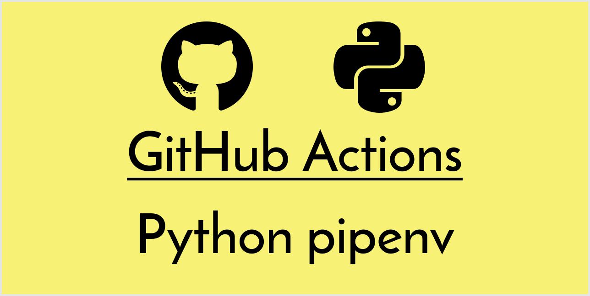

[](https://github.com/peaceiris/actions-pipenv/blob/master/LICENSE)
[](https://github.com/peaceiris/actions-pipenv/releases/latest)
[](https://github.com/peaceiris/actions-pipenv/releases)




## GitHub Actions for pipenv - Python

- [pypa/pipenv: Python Development Workflow for Humans.](https://github.com/pypa/pipenv)


## Getting started

### Create `main.workflow`

```hcl
workflow "Python workflow" {
  on = "push"
  resolves = ["test"]
}

action "pipenv-sync" {
  uses = "peaceiris/actions-pipenv@3.6"
  args = ["sync"]
}

action "test" {
  needs = "pipenv-sync"
  uses = "peaceiris/actions-pipenv@3.6"
  args = ["run", "test"]
}
```


## License

[MIT License - peaceiris/actions-pipenv]

[MIT License - peaceiris/actions-pipenv]: https://github.com/peaceiris/actions-pipenv/blob/master/LICENSE


## About the author

- [peaceiris's homepage](https://peaceiris.com/)
